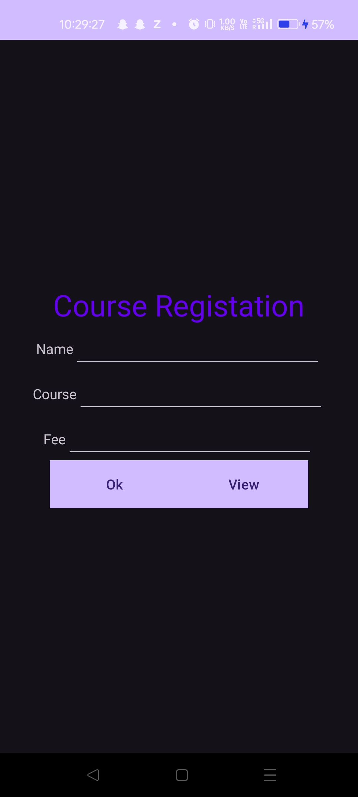
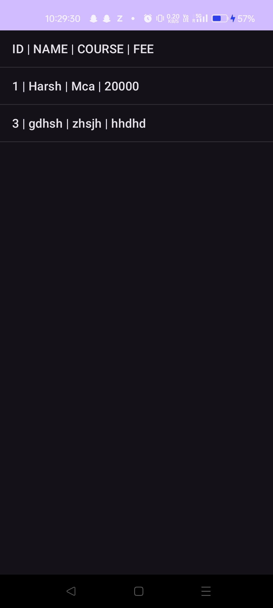
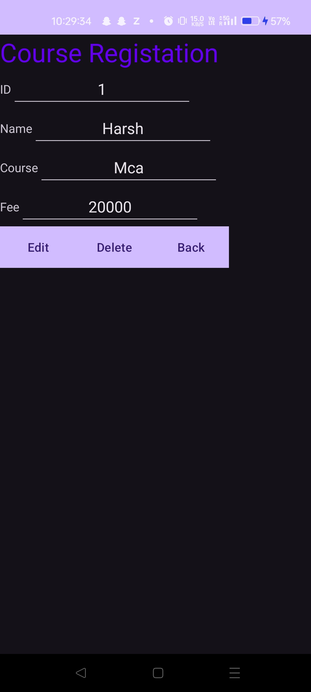

# Course Registration App

## 📌 Overview

The **Course Registration App** is an Android application built using **Java** and **SQLite** in **Android Studio**.  
It allows users to register courses by entering their **Name**, **Course**, and **Fee**.  
All data is stored **offline** in an SQLite database, and users can **View**, **Edit**, or **Delete** their entries.

This project requires **NO additional setup** — simply open the folder in Android Studio and run the app.

---

## 🚀 Features

- 📝 Register Name, Course & Fee  
- 💾 Offline SQLite database  
- 📋 View all stored records  
- ✏️ Edit any record  
- 🗑️ Delete any record  
- 🔌 Works fully offline  

---

## 📱 Screenshots

> Add actual image paths here when uploading to GitHub

<h3>Registration Screen</h3>

<h3>View All Records</h3>

<h3>Edit / Delete Screen</h3>

---

## 🛠️ How It Works

1. Open the project folder in **Android Studio**
2. Click **Run** ▶️
3. On the home screen:
   - Enter **Name**
   - Enter **Course**
   - Enter **Fee**
   - Press **OK** to save
4. Tap **View** to see all saved records
5. Tap any record to:
   - **Edit**
   - **Delete**
   - **Go Back**

No configuration or dependency installation needed.

---

## 📂 Technologies Used

- **Java (Android)**
- **SQLite Database**
- **XML for UI**
- **Android Studio**

---

## ▶️ Installation (Very Simple)

1. Open **Android Studio**
2. Click **Open Existing Project**
3. Select the project folder
4. Press **Run** ▶️

That's all — app will start running.

---

## 🤝 Contributing

You are welcome to improve the UI, add features, or optimize code by making a pull request.

